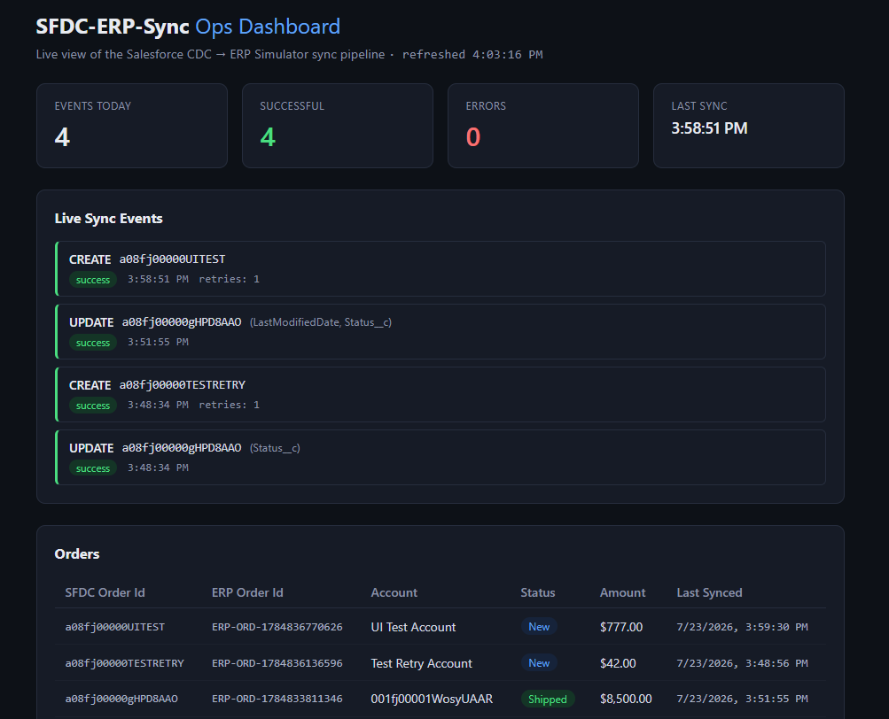
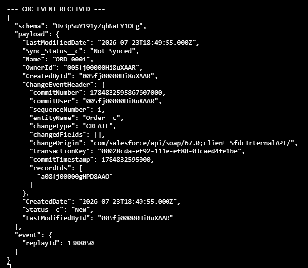

# SFDC-ERP-Sync

A Salesforce-centered integration project simulating a real enterprise pattern: bidirectional sync between Salesforce and an external ERP system. Order changes flow **out** of Salesforce via Change Data Capture; inventory changes flow **back in** from the ERP via a webhook and the Salesforce REST API. A live operations dashboard monitors the pipeline and lets an operator retry failed syncs, and a CI/CD pipeline validates every layer (Apex, Node, and the API contract) on every push.

Built to mirror the kind of work a Salesforce Integration Developer does on an enterprise team: event-driven sync off Change Data Capture, JWT bearer service-to-service auth (no stored passwords), idempotent upserts keyed on external IDs, Apex trigger logic that enforces a business rule at the data layer, and observability into a sync pipeline that can fail and recover.

## Screenshots

**Live Ops Dashboard**



**A real Change Data Capture event, captured off Salesforce**



## Architecture

```
                     ┌─────────────────────┐
   CDC event         │      Salesforce      │        REST API (JWT bearer)
   (Order__c) ───────│  Order__c/Inventory__c│◀───────── upsert by
        │            │  Trigger + PermSet    │           External ID
        ▼            └─────────────────────┘                  ▲
┌──────────────────┐                                   ┌───────┴────────┐
│ Integration       │──── POST /orders ───────────────▶│  ERP Simulator  │
│ Service (Node)     │◀─── POST /webhooks/... ──────────│ (Express +      │
│ JWT auth,          │      inventory-changed            │  Postgres)      │
│ CDC subscriber,     │                                   │ /metrics, retry │
│ webhook receiver    │                                   └───────┬────────┘
└──────────────────┘                                           │ polled by
                                                                 ▼
                                                      ┌────────────────┐
                                                      │  Ops Dashboard  │
                                                      │  (Vue 3 + Vite) │
                                                      └────────────────┘
```

Four pieces, plus a CI pipeline that exercises all of them:

- **Salesforce** (`force-app/`) — `Order__c` and `Inventory__c` custom objects, Change Data Capture enabled, a least-privilege permission set, a Connected App configured for the OAuth JWT bearer flow, and an Apex trigger that enforces a business rule (see below).
- **Integration Service** (`integration-service/`) — a Node.js process that authenticates to Salesforce via JWT bearer flow (RSA-signed assertion, no password), subscribes to the `Order__ChangeEvent` channel, and pushes order changes to the ERP Simulator. It also runs a small Express server that receives inventory-change webhooks from the ERP and pushes them back into Salesforce. Every sync attempt — success or failure, in either direction — is logged for observability.
- **ERP Simulator** (`erp-simulator/`) — an Express + PostgreSQL (Dockerized) REST API standing in for a real ERP like Oracle EBS/Fusion. Stores orders and inventory, tracks every sync event with retry support, fires outbound webhooks on inventory changes, and exposes `/metrics` for the dashboard.
- **Ops Dashboard** (`dashboard/`) — a Vue 3 + Vite app polling the ERP Simulator: live metric tiles, a color-coded sync event feed with one-click retry, and an orders table.
- **CI/CD** (`.github/workflows/ci.yml`) — GitHub Actions pipeline that runs Jest unit tests, Newman/Postman contract tests against a real Postgres service container, builds the dashboard, and deploys + runs Apex tests against a live Salesforce org via JWT auth.

## Technologies used

| Layer                 | Technology                                                                            |
| --------------------- | ------------------------------------------------------------------------------------- |
| CRM platform          | Salesforce (custom objects, Change Data Capture, Apex triggers, permission sets)      |
| Salesforce auth       | OAuth 2.0 JWT Bearer Flow (RSA-signed assertion, `jsonwebtoken`)                      |
| Salesforce API client | `jsforce` (streaming CDC subscription + REST calls)                                   |
| Integration Service   | Node.js, Express 5                                                                    |
| ERP Simulator API     | Node.js, Express 5, `pg` (node-postgres)                                              |
| Database              | PostgreSQL 16, Dockerized via `docker-compose`                                        |
| Dashboard             | Vue 3 (Composition API), Vite                                                         |
| Unit tests            | Jest + Supertest (ERP Simulator), Apex `@isTest` classes (Salesforce)                 |
| Contract tests        | Postman collection run via Newman                                                     |
| CI/CD                 | GitHub Actions (4 parallel/sequenced jobs, matrix of Node + Salesforce CLI)           |
| Tooling               | ESLint, Prettier (incl. `prettier-plugin-apex`), Husky + lint-staged pre-commit hooks |
| Salesforce CLI        | `sf` (project deploy, org auth, scratch org config)                                   |

## What was built, end to end

### 1. Outbound sync: Salesforce → ERP (Change Data Capture)

- `Order__c` has Change Data Capture enabled on its channel member (`force-app/main/default/platformEventChannelMembers/ChangeEvents_Order_ChangeEvent.platformEventChannelMember-meta.xml`).
- The Integration Service authenticates once at startup using the JWT bearer flow — it signs a JWT assertion with a private key (`SF_PRIVATE_KEY_PATH`) and exchanges it for an access token, so **no Salesforce password is ever stored**.
- It subscribes to `/data/Order__ChangeEvent` with `jsforce`'s streaming API. On `CREATE`/`UPDATE` it upserts the order into the ERP Simulator (`POST /orders`); on `DELETE` it soft-deletes the corresponding row (`DELETE /orders/:sfdcOrderId`).
- The ERP Simulator's `upsertOrder` keys on `sfdc_order_id`: if a row already exists it does a partial `UPDATE` of only the fields present in the payload; otherwise it `INSERT`s a new row with a generated `ERP-ORD-<timestamp>` ID.
- Every attempt (success or error) is recorded in a `sync_events` table via `POST /events`, including the raw payload — this is what powers the dashboard's event feed and its retry button.

### 2. Reverse sync: ERP → Salesforce (webhook + external-ID upsert)

- When the ERP Simulator creates or updates an inventory row (`POST /inventory`), it fires a fire-and-forget webhook to the Integration Service (`notifyInventoryChanged`) — a webhook failure does not fail the original ERP write.
- The Integration Service's webhook receiver (`POST /webhooks/inventory-changed`) calls Salesforce's REST API upsert-by-external-ID endpoint: `PATCH /sobjects/Inventory__c/ERP_Item_Id__c/<id>`. This lets the ERP be the system of record for inventory without the Integration Service needing to know the Salesforce record Id up front — Salesforce resolves create-vs-update by the external ID field.
- If the access token has expired (HTTP 401), the service re-authenticates once and retries automatically (`upsertInventoryInSalesforce`'s `isRetry` guard) — the Integration Service is long-running, so the token from startup will not survive indefinitely.
- The result (created vs. updated) is logged as a `sync_event` with `changeType: "INVENTORY_UPDATE"`, same as the outbound path, so both directions show up in one unified feed on the dashboard.

### 3. Apex trigger: enforcing a business rule at the data layer

- `OrderTrigger` (before update) calls `OrderTriggerHandler.preventShippingWithoutErpSync`, which blocks an `Order__c` from moving to `Status__c = 'Shipped'` unless `ERP_Order_Id__c` is already populated — i.e., you cannot ship an order Salesforce doesn't yet know has synced to the ERP.
- Covered by `OrderTriggerHandlerTest` (3 test methods): shipping without an ERP Id throws and is caught, shipping succeeds once the ERP Id is set, and non-Shipped status transitions are never blocked.

### 4. A real bug, caught and fixed

Salesforce CDC `UPDATE` events only include the fields that actually changed, not the full record. An early version of the sync treated the payload as the complete desired state and silently nulled out fields that weren't part of the change. Fixed with true partial-update semantics on both the consumer (`syncOrderToErp` only sets keys that are `!== undefined`) and the ERP API (`upsertOrder` builds its `UPDATE` statement dynamically from only the provided fields). A good example of a CDC-specific gotcha that's easy to miss.

### 5. Known limitation

The CDC payload's `Account__c` is the Account's record Id, not its Name, since Change Data Capture does not traverse relationships by default. A production version would add `Account.Name` as an enriched field on the channel member, or do a follow-up SOQL query.

### 6. Observability

Rather than reaching for Datadog, a lightweight `sync_events` table (`erp-simulator/002_sync_events.sql`) plus the Vue dashboard covers the same need for this project's scale — explicitly a simplification, called out rather than hidden. The dashboard polls `/metrics` and `/events` and renders:

- **Metric tiles** — events today, successes, errors, last event timestamp.
- **Event feed** — color-coded by status, with a one-click **Retry** button that calls `POST /events/:id/retry`, which replays the original payload through `upsertOrder`.
- **Orders table** — current state of every synced order.

### 7. Automated testing

- **Jest + Supertest** (`erp-simulator/__tests__/server.test.js`, 230 lines) — unit tests against the Express app in-process, covering order upsert (create vs. update, partial-field updates), soft-delete, inventory upsert, event logging, `/metrics`, and the retry endpoint.
- **Postman/Newman contract tests** (`erp-simulator/postman/erp-simulator.postman_collection.json`, 22 requests) — black-box tests run with `newman run` against a live server + real Postgres instance, verifying the actual HTTP contract rather than mocked internals.
- **Apex `@isTest` classes** (`OrderTriggerHandlerTest`) — verify the shipping-guard trigger logic inside the Salesforce org itself.
- **Husky + lint-staged** pre-commit hook — runs Prettier (with the Apex plugin) and ESLint on staged files before every commit.

### 8. CI/CD pipeline (`.github/workflows/ci.yml`)

Runs on every push/PR to `master`, as four jobs:

1. **ERP Simulator — Unit Tests**: `npm ci && npm test` (Jest).
2. **ERP Simulator — Contract Tests (Newman)**: spins up a real `postgres:16-alpine` service container, applies all three SQL migrations in order, boots the Express server, waits on `/health`, then runs the full Postman collection with Newman.
3. **Dashboard — Build**: `npm ci && npm run build` to catch Vite/Vue build breakage.
4. **Salesforce — Deploy & Test**: installs the Salesforce CLI, authenticates to a real org via JWT bearer flow using repo secrets (`SF_JWT_PRIVATE_KEY`, `SF_CONSUMER_KEY`, `SF_USERNAME`, `SF_LOGIN_URL`), then either `sf project deploy validate` (on PRs, dry-run with `RunLocalTests`) or `sf project deploy start` (on push to `master`, real deploy with `RunLocalTests`). The JWT key file is always cleaned up afterward, even on failure.

## Data model

- **`Order__c`**: `Account__c` (lookup), `Amount__c`, `Status__c`, `Sync_Status__c`, `ERP_Order_Id__c` (external key back to the ERP), `Last_Synced_At__c`.
- **`Inventory__c`**: `ERP_Item_Id__c` (external ID field, upsert key), `Product_Name__c`, `Quantity_On_Hand__c`, `Last_Synced_From_ERP__c`.
- **ERP `orders` table**: keyed on `sfdc_order_id`, carries `erp_order_id`, `account_name`, `status`, `amount`, `deleted_at` (soft delete, `003_soft_delete.sql`).
- **ERP `inventory` table**: keyed on `erp_item_id`, carries `product_name`, `quantity_on_hand`.
- **ERP `sync_events` table**: append-only log of every sync attempt in both directions — `sfdc_record_id`, `change_type`, `changed_fields`, `status`, `error_message`, `retry_count`, `payload` (JSONB).

## Setup

Prerequisites: Salesforce CLI, Node 18+, Docker.

**Salesforce:**

```
sf project deploy start --source-dir force-app
sf org assign permset --name SFDC_ERP_Sync_Access
```

Then create a Connected App with digital signatures enabled (JWT bearer flow) and note the Consumer Key.

**ERP Simulator:**

```
cd erp-simulator
docker compose up -d
npm install
npm run dev
```

**Integration Service:**

```
cd integration-service
npm install
# configure .env: SF_CONSUMER_KEY, SF_USERNAME, SF_LOGIN_URL, SF_PRIVATE_KEY_PATH, ERP_API_URL, WEBHOOK_PORT
node index.js
```

**Dashboard:**

```
cd dashboard
npm install
npm run dev
```

## Running the tests locally

```
# ERP Simulator unit tests
cd erp-simulator && npm test

# ERP Simulator contract tests (requires the server + Postgres running)
cd erp-simulator && npm run test:contract

# Apex tests (requires an authenticated scratch/dev org)
sf apex run test --test-level RunLocalTests --result-format human
```

## What's next

- Enrich the outbound CDC payload with `Account.Name` (currently only the Account Id is available without a follow-up query).
- Webhook signature verification on the Integration Service's `/webhooks/inventory-changed` endpoint, so it doesn't trust an unauthenticated caller.
- Dead-letter handling / alerting for sync events that fail repeated retries.
